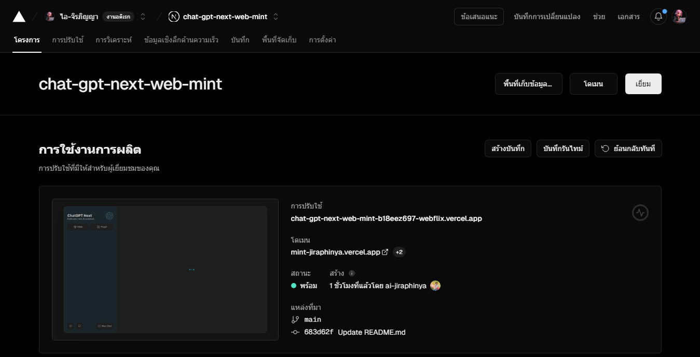

<div align="center">


<h1 align="center">ChatGPT-BotMint</h1> 


ไทย / ?


ปรับใช้แอปพลิเคชัน ChatGPT ส่วนตัวข้ามแพลตฟอร์มได้ในคลิกเดียว

[![Web][Web-image]][web-url]
[![Windows][Windows-image]][download-url]
[![MacOS][MacOS-image]][download-url]
[![Linux][Linux-image]][download-url]

[Web App](https://chatgpt.nextweb.fun/)  [Desktop App](https://github.com/Yidadaa/ChatGPT-Next-Web/releases)  [Buy Me a Coffee](https://www.buymeacoffee.com/ai.jiraphinya) [เวอร์ชันเว็บ](https://mint-jiraphinya.vercel.app) [นักพัฒนา](https://jiraphinya.coffeecup.com)


[web-url]: https://mint-jiraphinya.vercel.app
[download-url]: https://github.com/Yidadaa/ChatGPT-Next-Web/releases
[Web-image]: https://img.shields.io/badge/Web-PWA-orange?logo=microsoftedge
[Windows-image]: https://img.shields.io/badge/-Windows-blue?logo=windows
[MacOS-image]: https://img.shields.io/badge/-MacOS-black?logo=apple
[Linux-image]: https://img.shields.io/badge/-Linux-333?logo=ubuntu

[](https://vercel.com/new/clone?repository-url=https%3A%2F%2Fgithub.com%2FYidadaa%2FChatGPT-Next-Web&env=OPENAI_API_KEY&env=CODE&project-name=chatgpt-next-web&repository-name=ChatGPT-Next-Web)



<h1 align="center">ปรับใช้ที่ vercel เป็นบริการฟรี สำหรับการใช้งานส่วนต้ว มีธีม มืด/สว่าง</h1>


</div>

## Features

- **ปรับใช้ฟรีเพียงคลิกเดียว** บน Vercel ภายในเวลาไม่ถึง 1 นาที
- ไคลเอนต์ขนาดกะทัดรัด (~ 5MB) บน Linux/Windows/MacOS [ดาวน์โหลดทันที](https://github.com/Yidadaa/ChatGPT-Next-Web/releases)
- เข้ากันได้อย่างสมบูรณ์กับ llms ที่ปรับใช้ด้วยตนเอง แนะนำให้ใช้กับ [RWKV-Runner](https://github.com/josStorer/RWKV-Runner) หรือ [LocalAI](https://github.com/go-skynet/ LocalAI)
- ความเป็นส่วนตัวมาก่อน ข้อมูลทั้งหมดจัดเก็บไว้ในเบราว์เซอร์
- รองรับ Markdown: LaTex, นางเงือก, ไฮไลต์โค้ด ฯลฯ
- การออกแบบที่ตอบสนอง โหมดมืด และ PWA
- ความเร็วในการโหลดหน้าจอแรกที่รวดเร็ว (~ 100kb) รองรับการตอบสนองแบบสตรีมมิ่ง
- ใหม่ในเวอร์ชัน 2: สร้าง แบ่งปัน และแก้ไขเครื่องมือแชทของคุณด้วยเทมเพลตพร้อมท์ (มาสก์)
- ข้อความแจ้งที่ยอดเยี่ยมขับเคลื่อนโดย [awesome-chatgpt-prompts-zh](https://github.com/PlexPt/awesome-chatgpt-prompts-zh) 
- บีบอัดประวัติการแชทโดยอัตโนมัติเพื่อรองรับการสนทนาที่ยาวนานพร้อมทั้งบันทึกโทเค็นของคุณ
- I18n: อังกฤษ, 简体中文, 繁体中文, 日本語, Français, Español, Italiano, Türkçe, Deutsch, Tiếng Viết, Русский, čeština, เกาหลี, อินโดนีเซีย

## Roadmap

- 🚀 
- 🚀


## What's New

- 🚀  ตอนนี้คุณสามารถสร้างเทมเพลตพร้อมท์ เปลี่ยนความคิดของคุณให้กลายเป็นจริงได้! Read this: [ChatGPT Prompt Engineering Tips: Zero, One and Few Shot Prompting](https://www.allabtai.com/prompt-engineering-tips-zero-one-and-few-shot-prompting/).
- 🚀 
- 🚀 


[English > FAQ](./docs/faq-en.md)

## Keep Updated

>

หากคุณปรับใช้โปรเจ็กต์ของคุณเองด้วยการคลิกเพียงครั้งเดียวโดยทำตามขั้นตอนข้างต้น คุณอาจประสบปัญหา "การอัปเดตที่พร้อมใช้งาน" ปรากฏขึ้นอย่างต่อเนื่อง เนื่องจาก Vercel จะสร้างโปรเจ็กต์ใหม่ให้คุณตามค่าเริ่มต้น แทนที่จะแยกโปรเจ็กต์นี้ ส่งผลให้ไม่สามารถตรวจจับการอัปเดตได้อย่างถูกต้อง

เราขอแนะนำให้คุณทำตามขั้นตอนด้านล่างเพื่อปรับใช้อีกครั้ง:

- ลบที่เก็บข้อมูลดั้งเดิม
- ใช้ปุ่มส้อมที่มุมขวาบนของหน้าเพื่อแยกโปรเจ็กต์นี้
- เลือกและปรับใช้ใน Vercel อีกครั้ง
### Enable Automatic Updates

> หากคุณพบความล้มเหลวในการดำเนินการ Upstream Sync โปรดซิงค์ Fork ด้วยตนเองหนึ่งครั้ง

หลังจากการฟอร์กโปรเจ็กต์ เนื่องจากข้อจำกัดที่กำหนดโดย GitHub 
คุณจะต้องเปิดใช้งานเวิร์กโฟลว์และการดำเนินการซิงค์อัปสตรีมด้วยตนเองบนหน้าการดำเนินการของโปรเจ็กต์ที่แยกออกมา 
เมื่อเปิดใช้งานแล้ว ระบบจะกำหนดเวลาการอัปเดตอัตโนมัติทุกชั่วโมง:


โปรเจ็กต์นี้มีการควบคุมการเข้าถึงที่จำกัด โปรดเพิ่มตัวแปรสภาพแวดล้อมชื่อ `CODE` ในหน้าตัวแปรสภาพแวดล้อม Vercel ค่าควรเป็นรหัสผ่านคั่นด้วยเครื่องหมายจุลภาคดังนี้:

```
code1,code2,code3
```

After adding or modifying this environment variable, please redeploy the project for the changes to take effect.

## Environment Variables

หลังจากเพิ่มหรือแก้ไขตัวแปรสภาพแวดล้อมนี้แล้ว โปรดปรับใช้โปรเจ็กต์อีกครั้งเพื่อให้การเปลี่ยนแปลงมีผล

### `CODE` (optional)

Access password, separated by comma.

### `OPENAI_API_KEY` (required)

Your openai api key, join multiple api keys with comma.

### `BASE_URL` (optional)

> Default: `https://api.openai.com`

> Examples: `http://your-openai-proxy.com`

Override openai api request base url.

### `OPENAI_ORG_ID` (optional)

Specify OpenAI organization ID.

### `AZURE_URL` (optional)

> Example: https://{azure-resource-url}/openai/deployments/{deploy-name}

Azure deploy url.

### `AZURE_API_KEY` (optional)

Azure Api Key.

### `AZURE_API_VERSION` (optional)

Azure Api Version, find it at [Azure Documentation](https://learn.microsoft.com/en-us/azure/ai-services/openai/reference#chat-completions).

### `HIDE_USER_API_KEY` (optional)

> Default: Empty

If you do not want users to input their own API key, set this value to 1.

### `DISABLE_GPT4` (optional)

> Default: Empty

If you do not want users to use GPT-4, set this value to 1.

### `ENABLE_BALANCE_QUERY` (optional)

> Default: Empty

If you do want users to query balance, set this value to 1, or you should set it to 0.

### `DISABLE_FAST_LINK` (optional)

> Default: Empty

If you want to disable parse settings from url, set this to 1.

### `CUSTOM_MODELS` (optional)

> Default: Empty
> Example: `+llama,+claude-2,-gpt-3.5-turbo,gpt-4-1106-preview=gpt-4-turbo` means add `llama, claude-2` to model list, and remove `gpt-3.5-turbo` from list, and display `gpt-4-1106-preview` as `gpt-4-turbo`.

To control custom models, use `+` to add a custom model, use `-` to hide a model, use `name=displayName` to customize model name, separated by comma.

User `-all` to disable all default models, `+all` to enable all default models.

## Requirements

NodeJS >= 18, Docker >= 20

## Development


ก่อนที่จะเริ่มการพัฒนา คุณต้องสร้างไฟล์ `.env.local` ใหม่ที่รูทโปรเจ็กต์ และวางคีย์ API ของคุณลงไป:

ก่อนที่จะเริ่มการพัฒนา คุณต้องสร้างไฟล์ `.env.local` ใหม่ที่รูทโปรเจ็กต์ และวางคีย์ API ของคุณลงไป:

```
OPENAI_API_KEY=<your api key here>

# if you are not able to access openai service, use this BASE_URL
BASE_URL=mint-jiraphinya.vercel.app/api/proxy
```

### Local Development

```shell
# 1. install nodejs and yarn first
# 2. config local env vars in `.env.local`
# 3. run
yarn install
yarn dev
```

## Deployment


You can start service behind a proxy:

```shell
docker run -d -p 3000:3000 \
   -e OPENAI_API_KEY=sk-xxxx \
   -e CODE=your-password \
   -e PROXY_URL=http://localhost:7890 \
   ai-jiraphinya/ChatGPT-Next-Web-Mint
```

If your proxy needs password, use:

```shell
-e PROXY_URL="http://127.0.0.1:7890 user pass"
```


## Documentation

> Please go to the [docs][./docs] directory for more documentation instructions.


- [Frequent Ask Questions](./docs/faq-en.md)
- [How to add a new translation](./docs/translation.md)
- [How to use Vercel (No English)](./docs/vercel-cn.md)


## Donation

[Buy Me a Coffee](https://www.buymeacoffee.com/ai-jiraphinya)


